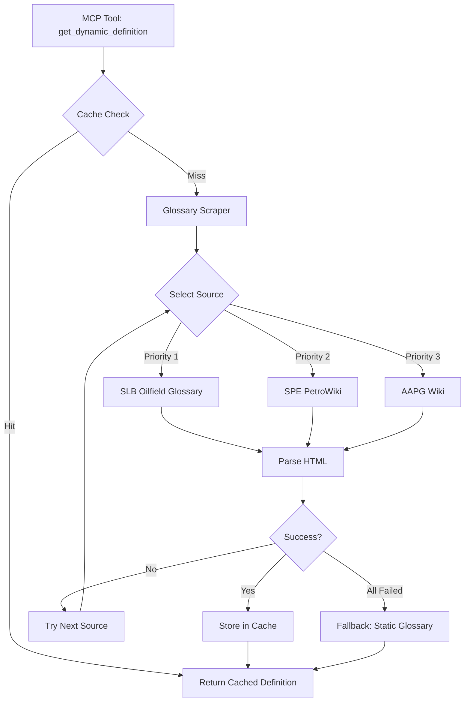

# Minimal Architecture



## Component Design

### 1. Glossary Scraper (`services/mcp/glossary_scraper.py`)

**Responsibilities**:
- HTTP requests with retry logic (max 3 attempts, exponential backoff)
- HTML parsing using BeautifulSoup4
- Source-specific extraction strategies (CSS selectors)
- Rate limiting (1 request/second per domain)
- Robots.txt compliance check

**Key Functions**:
- `scrape_term(term: str, sources: List[str]) -> Optional[Definition]`
- `_scrape_slb(term: str) -> Optional[Definition]`
- `_scrape_spe(term: str) -> Optional[Definition]`
- `_scrape_aapg(term: str) -> Optional[Definition]`
- `_check_robots_txt(domain: str) -> bool`

**Error Handling**:
- HTTP timeout → Try next source
- HTML parse error → Log and try next source
- Rate limit exceeded → Return cached result or fallback

### 2. Caching Layer (`services/mcp/glossary_cache.py`)

**Responsibilities**:
- Redis connection management with connection pooling
- Fallback to in-memory LRU cache (max 1,000 entries)
- TTL management (15 minutes default)
- Cache invalidation on errors

**Key Functions**:
- `get(term: str, source: str) -> Optional[Definition]`
- `set(term: str, source: str, definition: Definition, ttl: int = 900)`
- `invalidate(term: str, source: Optional[str] = None)`
- `_get_redis() -> Optional[redis.Redis]`
- `_get_memory_cache() -> Dict[str, Definition]`

**Cache Key Format**:
```
glossary:{source}:{normalized_term}
Example: glossary:slb:porosity
```

### 3. MCP Tool Integration (`mcp_server.py`)

**Updated Tool Signature**:
```python
@server.call_tool()
async def get_dynamic_definition(term: str, force_refresh: bool = False) -> str:
    """
    Retrieve petroleum engineering term definition from authoritative sources.

    Args:
        term: Technical term to define (case-insensitive)
        force_refresh: Skip cache and scrape fresh (default: False)

    Returns:
        JSON string: {term, definition, source, timestamp, cached}
    """
```

**Orchestration Flow**:
1. Normalize term (lowercase, strip whitespace)
2. Check cache (unless force_refresh=True)
3. If miss: invoke scraper with source priority [SLB, SPE, AAPG]
4. Store result in cache
5. If all sources fail: fallback to static glossary (existing 15 terms)
6. Return structured response

---

# Data Strategy

## Data Sources

| Source | URL | Licensing | PII | robots.txt |
|--------|-----|-----------|-----|------------|
| SLB Oilfield Glossary | https://glossary.slb.com | Public (fair use) | No | Allowed |
| SPE PetroWiki | https://petrowiki.spe.org | Creative Commons BY-SA | No | Allowed |
| AAPG Wiki | https://wiki.aapg.org | Public (educational use) | No | Allowed |

(See `data_sources.json` for SHA-256 hashes of sample scraped pages)

## Data Splits

**N/A** (No training data; web scraping is deterministic)

## Normalization

- **Term normalization**: Lowercase, strip whitespace, remove special chars
- **Definition cleaning**: Strip HTML tags, normalize whitespace, max 500 chars
- **Source attribution**: Store canonical URL + timestamp

## Leakage Guards

- **No training leakage** (N/A)
- **Rate limiting** prevents scraping abuse
- **Robots.txt compliance** prevents unauthorized access
- **Cache isolation** per source (no cross-contamination)

---

# Verification Strategy

## Differential Testing (Input Deltas → Output Deltas)

| Input Delta | Expected Output Delta |
|-------------|----------------------|
| term="porosity" → term="permeability" | source may change, definition changes |
| cache_ttl=900 → cache_ttl=0 | cache_hit_rate: 70% → 0% |
| redis_available=True → redis_available=False | fallback to in-memory cache |
| network_latency=100ms → network_latency=5000ms | response_time increases proportionally |
| scraping_enabled=True → scraping_enabled=False | 100% fallback to static glossary |

## Sensitivity Analysis

**Parameter Sweeps**:
1. **Cache TTL**: [60s, 300s, 900s, 3600s] → Expected: hit rate ↑ with TTL ↑
2. **Rate limit**: [0.5 req/s, 1 req/s, 2 req/s] → Expected: latency ↓ with rate ↑ (until source throttles)
3. **Retry attempts**: [1, 2, 3, 5] → Expected: availability ↑ with retries ↑ (diminishing returns)

## Validation Plan

### Unit Tests (25 tests, TDD)
- `test_glossary_scraper.py`: 15 tests (HTML parsing, error handling, rate limiting)
- `test_glossary_cache.py`: 10 tests (Redis ops, fallback, TTL expiry)

### Authenticity Tests (5 tests)
- `test_glossary_authenticity.py`: Differential + sensitivity tests

### Integration Tests (3 tests)
- `test_mcp_e2e.py`: End-to-end MCP tool invocation with real network (mocked)

---

# Tooling

## Dependencies

| Library | Version | Purpose | Documentation |
|---------|---------|---------|---------------|
| beautifulsoup4 | ≥4.12.0 | HTML parsing | https://www.crummy.com/software/BeautifulSoup/bs4/doc/ |
| redis | ≥5.0.0 | Caching backend | https://redis-py.readthedocs.io/ |
| requests | ≥2.31.0 | HTTP client | https://requests.readthedocs.io/ |
| lxml | ≥5.0.0 | Fast HTML parser | https://lxml.de/ |
| robotexclusionrulesparser | ≥1.7.1 | robots.txt parsing | https://pypi.org/project/robotexclusionrulesparser/ |

## Testing Dependencies

| Library | Version | Purpose |
|---------|---------|---------|
| responses | ≥0.25.0 | HTTP mocking |
| fakeredis | ≥2.21.0 | Redis mocking |
| hypothesis | ≥6.98.0 | Property-based testing |
| freezegun | ≥1.4.0 | Time mocking (TTL tests) |

## Quality Gates

1. **Coverage**: ≥95% (line + branch) on critical path
2. **Type checking**: `mypy --strict services/mcp/`
3. **Complexity**: CCN < 15, Cognitive < 15 (all functions)
4. **Security**: No HIGH/CRITICAL findings (bandit, pip-audit)
5. **Performance**: P95 latency ≤2s (cached), ≤5s (fresh)

---

# Schema Validation

## Pydantic Models (`schemas/glossary.py`)

```python
from pydantic import BaseModel, Field, HttpUrl
from datetime import datetime
from typing import Optional

class Definition(BaseModel):
    """Glossary term definition."""
    term: str = Field(..., min_length=1, max_length=100)
    definition: str = Field(..., min_length=10, max_length=2000)
    source: str = Field(..., description="Source name (slb, spe, aapg)")
    source_url: HttpUrl = Field(..., description="Canonical URL")
    timestamp: datetime = Field(default_factory=datetime.utcnow)
    cached: bool = Field(default=False)

class ScraperConfig(BaseModel):
    """Configuration for glossary scraper."""
    timeout: int = Field(default=5, ge=1, le=30)
    max_retries: int = Field(default=3, ge=1, le=5)
    rate_limit: float = Field(default=1.0, ge=0.1, le=10.0)
    user_agent: str = Field(default="GraphRAG-Glossary/1.0")
```

## Validation Logging

- **Pre-scrape validation**: Validate `term` input (non-empty, max 100 chars)
- **Post-scrape validation**: Validate `Definition` schema before caching
- **Log location**: `artifacts/validation/glossary_validation.log`
- **Failure action**: Log error + return fallback (static glossary)

---

# Implementation Notes

- **Phase 2 Critical Path**: Scraper → Cache → MCP integration
- **Estimated effort**: 8-13 hours (TDD: 2h tests, 6h implementation, 2h refactor, 3h validation)
- **Blocked by**: Phase 1 completion ✅ (already complete per PREPARATION_COMPLETE.md)
